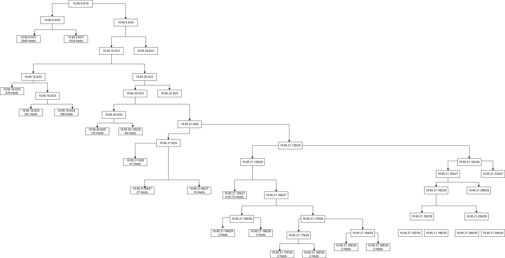
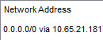

# Praktikum Modul 4 Jaringan Komputer

Praktikum Modul 4 Jaringan Komputer - **IT-03**

## Authors

| Nama                                                | NRP        |
| --------------------------------------------------- | ---------- |
| [Sighra Attariq Sumere Jati](https://www.github.com/sgraa) | 5027221068 |
| [Wilson Matthew Thendry](https://www.github.com/waifuwetdream) | 5027221024 |

# IP Prefix
`10.65`

## Daftar isi
- [Topologi](#topologi)
- [Rute Subnet](#rute-subnet)
- [VLSM](#vlsm)
- [CIDR](#cidr)

# Topologi
### Cisco Packet Tracer | VLSM |


### GNS3 | CIDR |


# Rute Subnet
| Nama Subnet | Rute                                                       | Jumlah IP | Netmask |
|-------------|------------------------------------------------------------|-----------|---------|
| A1          | Jawa > Sumatera                                            | 2         | /30     |
| A2          | Sumatera > SW Toba > Samosir > SW Toba > Sibandang > SW Toba > Sumatera Utara | 27        | /27     |
| A3          | Sumatera > Lampung                                         | 2         | /24     |
| A4          | Lampung > SW Bandar Lampung  > Sebuku > SW Bandar Lampung > Sebesi | 188       | /27     |
| A5          | Sumatera Utara > Aceh                                      | 2         | /30     |
| A6          | Aceh > SW Blangrakal > Berawang Tampu > SW Blangrakal > Enang-Enang > SW Blangrakal > Starland | 125       | /25     |
| A7          | Aceh > SW Banda Aceh > Sabang > SW Banda Aceh > Lambaro    | 15        | /27     |
| A8          | Jawa > Kalimantan                                          | 2         | /30     |
| A9          | Kalimantan > Kalimantan Utara                              | 2         | /30     |
| A10         | Kalimantan Utara > SW Tanjung Selor > Selimau              | 201       | /24     |
| A11         | Kalimantan Utara > Kalimantan Timur                        | 2         | /30     |
| A12         | Kalimantan Timur > SW Balikpapan > Bangkirai > SW Balikpapan > Lamaru | 470       | /23     |
| A13         | Kalimantan Timur > Kalimantan Selatan                      | 2         | /30     |
| A14         | Kalimantan Selatan > SW Boenati > Angsana                  | 16        | /27     |
| A15         | Kalimantan Selatan > SW Banjarmasin > Bajuin > SW Banjarmasin > Takisung > SW Banjarmasin > Batakan | 2045      | /21     |
| A16         | Jawa > Sulawesi                                            | 2         | /30     |
| A17         | Sulawesi > SW Sulsel > Makassar > SW Sulsel > Belawa       | 3         | /29     |
| A18         | Makasar > SW Limbung > Galesong  > SW Limbung > Topejawa-Talakar | 3         | /29     |
| A19         | Belawa > SW Tempe > Madini > SW Tempe > Baru               | 61        | /26     |
| A20         | Sulawesi > SW Gorontalo > Gorontalo > SW Gorontalo > Marisa > Maluku Utara | 64        | /25     |
| A21         | Maluku Utara > SW Maluku > Tobelo > SW Maluku > Morotai > SW Maluku > Ternate | 1024      | /21     |
| Total       |                                                            | 4258      | /19     |


# VLSM
VLSM digunakan pada Cisco Packet Tracer `CPT`

## Tree VLSM
Berikut adalah Tree yang digunakan sebagai visualisasi VLSM.



## Pembagian IP VLSM
Berikut adalah pembagian IP pada VLSM.

IP Prefix: `10.65`

| Subnet | Network ID    | Netmask         | Broadcast      | Range IP                 |
|--------|---------------|-----------------|----------------|--------------------------|
| A1     | 10.65.21.176  | 255.255.255.252 | 10.65.21.179   | 10.65.21.177 - 10.65.21.178 |
| A2     | 10.65.21.64   | 255.255.255.224 | 10.65.21.95    | 10.65.21.66 - 10.65.21.94   |
| A3     | 10.65.21.180  | 255.255.255.252 | 10.65.21.183   | 10.65.21.181 - 10.65.21.182 |
| A4     | 10.65.19.0    | 255.255.255.0   | 10.65.19.255   | 10.65.19.1 - 10.65.19.254   |
| A5     | 10.65.21.184  | 255.255.255.252 | 10.65.21.187   | 10.65.21.185 - 10.65.21.186 |
| A6     | 10.65.20.0    | 255.255.255.128 | 10.65.20.127   | 10.65.20.1 - 10.65.20.126   |
| A7     | 10.65.21.128  | 255.255.255.224 | 10.65.21.159   | 10.65.21.129 - 10.65.21.158 |
| A8     | 10.65.21.188  | 255.255.255.252 | 10.65.21.191   | 10.65.21.189 - 10.65.21.190 |
| A9     | 10.65.21.192  | 255.255.255.252 | 10.65.21.195   | 10.65.21.193 - 10.65.21.194 |
| A10    | 10.65.18.0    | 255.255.255.0   | 10.65.18.255   | 10.65.18.1 - 10.65.18.254   |
| A11    | 10.65.21.196  | 255.255.255.252 | 10.65.21.199   | 10.65.21.197 - 10.65.21.198 |
| A12    | 10.65.16.0    | 255.255.254.0   | 10.65.17.255   | 10.65.16.1 - 10.65.17.254   |
| A13    | 10.65.21.200  | 255.255.255.252 | 10.65.21.203   | 10.65.21.201 - 10.65.21.202 |
| A14    | 10.65.21.96   | 255.255.255.224 | 10.65.21.127   | 10.65.21.97 - 10.65.21.126  |
| A15    | 10.65.0.0     | 255.255.248.0   | 10.65.7.255    | 10.65.0.1 - 10.65.7.254    |
| A16    | 10.65.21.204  | 255.255.255.252 | 10.65.21.207   | 10.65.21.205 - 10.65.21.206 |
| A17    | 10.65.21.160  | 255.255.255.248 | 10.65.21.167   | 10.65.21.161 - 10.65.21.166 |
| A18    | 10.65.21.168  | 255.255.255.248 | 10.65.21.175   | 10.65.21.169 - 10.65.21.174 |
| A19    | 10.65.21.0    | 255.255.255.192 | 10.65.21.63    | 10.65.21.1 - 10.65.21.62   |
| A20    | 10.65.20.128  | 255.255.255.128 | 10.65.20.255   | 10.65.20.129 - 10.65.20.254 |
| A21    | 10.65.8.0     | 255.255.248.0   | 10.65.15.255   | 10.65.8.1 - 10.65.15.254    |

## Konfigurasi
### Jawa (Router)
Network Address
<p align="center">
    
<p align="center">
     
<p align="center">
     
<p align="center">
     

### Aceh (Router)
Network Address
<p align="center">
     

### Lampung (Router)
Network Address
<p align="center">
     

### Kalimantan (Router)
Network Address
<p align="center">
     

### Kalimantan-Utara (Router)
Network Address
<p align="center">
    

### Kalimantan-Timur (Router)
Network Address
<p align="center">
    

### Kalimantan-Selatan (Router)
Network Address
<p align="center">
    

### Sulawesi (Router)
Network Address
<p align="center">
    

### Belawa (Router)
Network Address
<p align="center">
    

### Makassar (Router)
Network Address
<p align="center">
    

### Maluku-Utara (Router)
Network Address
<p align="center">
    

## Hasil VLSM


# CIDR
## Penggabungan Subnet 

### I
<table>
  <thead>
    <tr>
      <th rowspan="3">Subnet</th>
      <th colspan="4">Gabungan dari</th>
      <th rowspan="3">Netmask Akhir</th>
    </tr>
    <tr>
      <th colspan="2">1</th>
      <th colspan="2">2</th>
    </tr>
    <tr>
      <th>Subnet</th>
      <th>Netmask</th>
      <th>Subnet</th>
      <th>Netmask</th>
    </tr>
  </thead>
  <tbody>
    <tr>
      <td>B1</td>
      <td>A7</td>
      <td>/27</td>
      <td>A5</td>
      <td>/30</td>
      <td>/26</td>
    </tr>
    <tr>
      <td>B2</td>
      <td>A4</td>
      <td>/24</td>
      <td>A3</td>
      <td>/30</td>
      <td>/23</td>
    </tr>
    <tr>
      <td>B3</td>
      <td>A14</td>
      <td>/27</td>
      <td>A13</td>
      <td>/30</td>
      <td>/26</td>
    </tr>
    <tr>
      <td>B4</td>
      <td>A18</td>
      <td>/29</td>
      <td>A17</td>
      <td>/29</td>
      <td>/28</td>
    </tr>
  </tbody>
</table>

### II
<table>
  <thead>
    <tr>
      <th rowspan="3">Subnet</th>
      <th colspan="4">Gabungan dari</th>
      <th rowspan="3">Netmask Akhir</th>
    </tr>
    <tr>
      <th colspan="2">1</th>
      <th colspan="2">2</th>
    </tr>
    <tr>
      <th>Subnet</th>
      <th>Netmask</th>
      <th>Subnet</th>
      <th>Netmask</th>
    </tr>
  </thead>
  <tbody>
    <tr>
      <td>C1</td>
      <td>B1</td>
      <td>/26</td>
      <td>A2</td>
      <td>/27</td>
      <td>/25</td>
    </tr>
    <tr>
      <td>C2</td>
      <td>B2</td>
      <td>/22</td>
      <td>A1</td>
      <td>/30</td>
      <td>/21</td>
    </tr>
    <tr>
      <td>C3</td>
      <td>B3</td>
      <td>/26</td>
      <td>A11</td>
      <td>/30</td>
      <td>/25</td>
    </tr>
    <tr>
      <td>C4</td>
      <td>B4</td>
      <td>/26</td>
      <td>A19</td>
      <td>/26</td>
      <td>/25</td>
    </tr>
  </tbody>
</table>

### III
<table>
  <thead>
    <tr>
      <th rowspan="3">Subnet</th>
      <th colspan="4">Gabungan dari</th>
      <th rowspan="3">Netmask Akhir</th>
    </tr>
    <tr>
      <th colspan="2">1</th>
      <th colspan="2">2</th>
    </tr>
    <tr>
      <th>Subnet</th>
      <th>Netmask</th>
      <th>Subnet</th>
      <th>Netmask</th>
    </tr>
  </thead>
  <tbody>
    <tr>
      <td>D1</td>
      <td>C1</td>
      <td>/25</td>
      <td>A6</td>
      <td>/25</td>
      <td>/24</td>
    </tr>
    <tr>
      <td>D2</td>
      <td>C3</td>
      <td>/25</td>
      <td>A9</td>
      <td>/30</td>
      <td>/24</td>
    </tr>
    <tr>
      <td>D3</td>
      <td>C4</td>
      <td>/25</td>
      <td>A16</td>
      <td>/30</td>
      <td>/24</td>
    </tr>
  </tbody>
</table>


### IV
<table>
  <thead>
    <tr>
      <th rowspan="3">Subnet</th>
      <th colspan="4">Gabungan dari</th>
      <th rowspan="3">Netmask Akhir</th>
    </tr>
    <tr>
      <th colspan="2">1</th>
      <th colspan="2">2</th>
    </tr>
    <tr>
      <th>Subnet</th>
      <th>Netmask</th>
      <th>Subnet</th>
      <th>Netmask</th>
    </tr>
  </thead>
  <tbody>
    <tr>
      <td>E1</td>
      <td>D1</td>
      <td>/24</td>
      <td>C2</td>
      <td>/21</td>
      <td>/20</td>
    </tr>
    <tr>
      <td>E2</td>
      <td>D2</td>
      <td>/24</td>
      <td>A10</td>
      <td>/24</td>
      <td>/23</td>
    </tr>
    <tr>
      <td>E3</td>
      <td>D3</td>
      <td>/24</td>
      <td>A20</td>
      <td>/25</td>
      <td>/21</td>
    </tr>
  </tbody>
</table>

### V
<table>
  <thead>
    <tr>
      <th rowspan="3">Subnet</th>
      <th colspan="4">Gabungan dari</th>
      <th rowspan="3">Netmask Akhir</th>
    </tr>
    <tr>
      <th colspan="2">1</th>
      <th colspan="2">2</th>
    </tr>
    <tr>
      <th>Subnet</th>
      <th>Netmask</th>
      <th>Subnet</th>
      <th>Netmask</th>
    </tr>
  </thead>
  <tbody>
    <tr>
      <td>F1</td>
      <td>E2</td>
      <td>/23</td>
      <td>A12</td>
      <td>/23</td>
      <td>/22</td>
    </tr>
    <tr>
      <td>F2</td>
      <td>E3</td>
      <td>/21</td>
      <td>A21</td>
      <td>/21</td>
      <td>/20</td>
    </tr>
  </tbody>
</table>


### VI
<table>
  <thead>
    <tr>
      <th rowspan="3">Subnet</th>
      <th colspan="4">Gabungan dari</th>
      <th rowspan="3">Netmask Akhir</th>
    </tr>
    <tr>
      <th colspan="2">1</th>
      <th colspan="2">2</th>
    </tr>
    <tr>
      <th>Subnet</th>
      <th>Netmask</th>
      <th>Subnet</th>
      <th>Netmask</th>
    </tr>
  </thead>
  <tbody>
    <tr>
      <td>G1</td>
      <td>F1</td>
      <td>/22</td>
      <td>A8</td>
      <td>/30</td>
      <td>/21</td>
    </tr>
    <tr>
      <td>G2</td>
      <td>F2</td>
      <td>/20</td>
      <td>E1</td>
      <td>/20</td>
      <td>/19</td>
    </tr>
  </tbody>
</table>

### VII
<table>
  <thead>
    <tr>
      <th rowspan="3">Subnet</th>
      <th colspan="4">Gabungan dari</th>
      <th rowspan="3">Netmask Akhir</th>
    </tr>
    <tr>
      <th colspan="2">1</th>
      <th colspan="2">2</th>
    </tr>
    <tr>
      <th>Subnet</th>
      <th>Netmask</th>
      <th>Subnet</th>
      <th>Netmask</th>
    </tr>
  </thead>
  <tbody>
    <tr>
      <td>H1</td>
      <td>G1</td>
      <td>/21</td>
      <td>A15</td>
      <td>/21</td>
      <td>/20</td>
    </tr>
  </tbody>
</table>


### VIII
<table>
  <thead>
    <tr>
      <th rowspan="3">Subnet</th>
      <th colspan="4">Gabungan dari</th>
      <th rowspan="3">Netmask Akhir</th>
    </tr>
    <tr>
      <th colspan="2">1</th>
      <th colspan="2">2</th>
    </tr>
    <tr>
      <th>Subnet</th>
      <th>Netmask</th>
      <th>Subnet</th>
      <th>Netmask</th>
    </tr>
  </thead>
  <tbody>
    <tr>
      <td>I1</td>
      <td>H1</td>
      <td>/20</td>
      <td>G2</td>
      <td>/19</td>
      <td>/18</td>
    </tr>
  </tbody>
</table>

Didapatkan netmask akhir pada I1 adalah `/18`

## Pembagian IP CIDR
| Subnet | Network ID   | Netmask         | Broadcast      | Range IP               |
|--------|--------------|-----------------|----------------|------------------------|
| A1     | 10.65.36.0   | 255.255.255.252 | 10.65.36.3     | 10.65.36.1 - 10.65.36.2|
| A2     | 10.65.32.64  | 255.255.255.224 | 10.65.32.95    | 10.65.32.65 - 10.65.32.94|
| A3     | 10.65.34.0   | 255.255.255.252 | 10.65.34.3     | 10.65.34.1 - 10.65.34.2|
| A4     | 10.65.33.0   | 255.255.255.0   | 10.65.33.255   | 10.65.33.1 - 10.65.33.254|
| A5     | 10.65.32.32  | 255.255.255.252 | 10.65.32.35    | 10.65.32.33 - 10.65.32.34|
| A6     | 10.65.32.128 | 255.255.255.128 | 10.65.32.255   | 10.65.32.129 - 10.65.32.254|
| A7     | 10.65.32.0   | 255.255.255.224 | 10.65.32.31    | 10.65.32.1 - 10.65.32.30|
| A8     | 10.65.4.0    | 255.255.255.252 | 10.65.4.3      | 10.65.4.1 - 10.65.4.2|
| A9     | 10.65.0.128  | 255.255.255.252 | 10.65.0.131    | 10.65.0.129 - 10.65.0.130|
| A10    | 10.65.1.0    | 255.255.255.0   | 10.65.1.255    | 10.65.1.1 - 10.65.1.254|
| A11    | 10.65.0.64   | 255.255.255.252 | 10.65.0.67     | 10.65.0.65 - 10.65.0.66|
| A12    | 10.65.2.0    | 255.255.254.0   | 10.65.3.255    | 10.65.2.1 - 10.65.3.254|
| A13    | 10.65.0.32   | 255.255.255.252 | 10.65.0.35     | 10.65.0.33 - 10.65.0.34|
| A14    | 10.65.0.0    | 255.255.255.224 | 10.65.0.31     | 10.65.0.1 - 10.65.0.30|
| A15    | 10.65.8.0    | 255.255.248.0   | 10.65.15.255   | 10.65.8.1 - 10.65.15.254|
| A16    | 10.65.16.128 | 255.255.255.252 | 10.65.16.131   | 10.65.16.129 - 10.65.16.130|
| A17    | 10.65.16.8   | 255.255.255.248 | 10.65.16.15    | 10.65.16.9 - 10.65.16.14|
| A18    | 10.65.16.0   | 255.255.255.248 | 10.65.16.7     | 10.65.16.1 - 10.65.16.6|
| A19    | 10.65.16.64  | 255.255.255.192 | 10.65.16.127   | 10.65.16.65 - 10.65.16.126|
| A20    | 10.65.17.0   | 255.255.255.128 | 10.65.17.127   | 10.65.17.1 - 10.65.17.126|
| A21    | 10.65.24.0   | 255.255.248.0   | 10.65.31.255   | 10.65.24.1 - 10.65.31.254|

## Tree CIDR 


## Konfigurasi
### Jawa (Router)
```
auto eth0
iface eth0 inet dhcp
up iptables -t nat -A POSTROUTING -o eth0 -j MASQUERADE -s 10.65.0.0/16

#A16
auto eth1
iface eth1 inet static
  address 10.65.16.129
  netmask 255.255.255.252

#A8
auto eth2
iface eth2 inet static
  address 10.65.4.1
  netmask 255.255.255.252

#A1
auto eth3
iface eth3 inet static
  address 10.65.36.1
  netmask 255.255.255.252
```
### Sumatera (Router)
```
auto eth0
iface eth0 inet static
  address 10.65.36.2
  netmask 255.255.255.252

auto eth1
iface eth1 inet static
  address 10.65.32.65
  netmask 255.255.255.224

auto eth2
iface eth2 inet static
  address 10.65.34.1
  netmask 255.255.255.252
```
### Sumatera-Utara (Router)
```
auto eth0
iface eth0 inet static
  address 10.65.32.66
  netmask 255.255.255.224

auto eth1
iface eth1 inet static
  address 10.65.32.33
  netmask 255.255.255.252
```
### Aceh (Router)
```
#A5
auto eth0
iface eth0 inet static
  address 10.67.32.34
  netmask 255.255.255.252

#A7
auto eth1
iface eth1 inet static
  address 10.67.32.1
  netmask 255.255.255.224

#A6
auto eth2
iface eth2 inet static
  address 10.67.32.129
  netmask 255.255.255.128
```
### Lampung (Router)
```
auto eth0
iface eth0 inet static
  address 10.65.34.2
  netmask 255.255.255.252

auto eth1
iface eth1 inet static
  address 10.65.33.1
  netmask 255.255.255.0
```
### Kalimantan (Router)
```
#A8
auto eth0
iface eth0 inet static
  address 10.65.4.2
  netmask 255.255.255.252

#A9
auto eth2
 iface eth2 inet static
  	address 10.65.0.129
  	netmask 255.255.255.252
```
### Kalimantan-Utara (Router)
```
 auto eth0
 iface eth0 inet static
  	address 10.65.0.130
  	netmask 255.255.255.252
 
auto eth1
 iface eth1 inet static
  	address 10.65.1.1
  	netmask 255.255.255.0

auto eth2
 iface eth2 inet static
  	address 10.65.0.65
  	netmask 255.255.255.252
```
### Kalimantan-Timur (Router)
```
auto eth0
 iface eth0 inet static
  	address 10.65.0.66
  	netmask 255.255.255.252

auto eth1
 iface eth1 inet static
  	address 10.65.2.1
  	netmask 255.255.254.0

auto eth2
 iface eth2 inet static
  	address 10.65.0.33
  	netmask 255.255.255.252
```
### Kalimantan-Selatan (Router)
```
auto eth0
 iface eth0 inet static
  	address 10.65.0.34
  	netmask 255.255.255.252

auto eth1
 iface eth1 inet static
  	address 10.65.8.1
  	netmask 255.255.248.0

auto eth2
 iface eth2 inet static
  	address 10.65.0.1
  	netmask 255.255.255.224
```
### Sulawesi (Router)
```
#A16
auto eth0
iface eth0 inet static
  address 10.65.16.130
  netmask 255.255.255.252

#A20
auto eth1
 iface eth1 inet static
  	address 10.65.17.1
  	netmask 255.255.248.0

#A17
auto eth2
 iface eth2 inet static
  	address 10.65.16.9
  	netmask 255.255.255.248
```
### Makassar (Router)
```
#A17
auto eth0
iface eth0 inet static
  address 10.65.16.10
  netmask 255.255.255.248

#A18
auto eth1
iface eth1 inet static
  address 10.65.16.1
  netmask 255.255.255.248
```
### Belawa (Router)
```
#A17
auto eth0
iface eth0 inet static
  address 10.65.16.11
  netmask 255.255.255.248

#A19
auto eth1
iface eth1 inet static
  address 10.65.16.65
  netmask 255.255.255.192
```
### Maluku-Utara (Router)
```
 auto eth0
 iface eth0 inet static
  	address 10.65.17.2
  	netmask 255.255.248.0

 auto eth1
 iface eth1 inet static
  	address 10.65.24.1
  	netmask 255.255.248.0
```